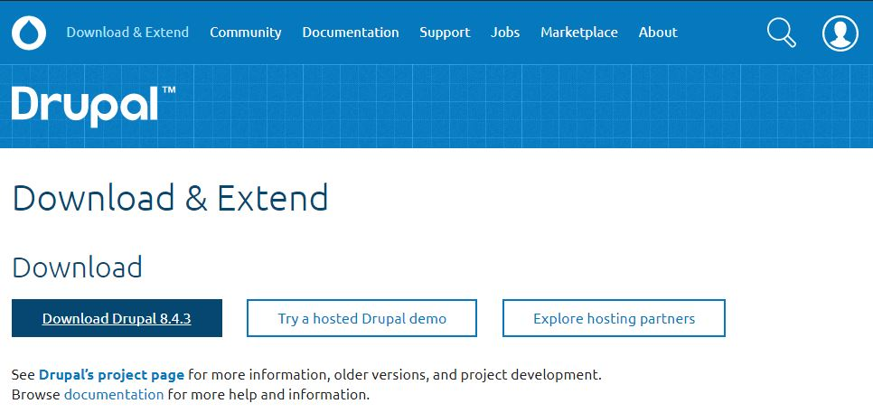

DRUPAL 8
========

1.INSTALACIÓN DRUPAL
====================

1.1.INSTALACIÓN BÁSICA DE DRUPAL
--------------------------------

1.1.1.Requisitos Básicos
-------------------------

Para poder instalar Drupal es necesario disponer de los siguientes requerimientos básicos:
* **PHP**, lenguaje sobre el que se escribe Drupal8.
* **MySQL**, lenguaje de gestión de base de Datos.
* **APACHE**, servidor que realice la comunicación entre el navegador y el servidor Virtual.
* **S.O.**, sistema operativo.

Para disponer de todos estos requisitos básicos podré instalar **[WAMP](http://www.wampserver.com/en/)** o **[XAMPP](https://www.apachefriends.org/es/index.html)**

1.1.2.Primeros Pasos de la Instalación Web Básica
-------------------------------------------------

Accedemos a [Drupal.org](https://www.drupal.org/) y hacemos click en [Dowload & Extend](https://www.drupal.org/download)

En la siguiente ventana podré descargarme la última versión estable de Drupal, en este caso podré descargar la versión de **Drupal 8.4.3** [descargar aquí](https://www.drupal.org/project/drupal/releases/8.4.3).

Podré descargar la versión de Drupal seleccionada con la extensión **[.tar.gz](https://ftp.drupal.org/files/projects/drupal-8.4.3.tar.gz)** o **[.zip](https://ftp.drupal.org/files/projects/drupal-8.4.3.zip)**.

Además en esta ventana tendré acceso al **Core** que es la versión que estaremos descargando, **Distributions** que son proyectos drupal ya configurados (e-commerce, red social,...), **Modules** y **Themes**

Descomprimo la carpeta y la guardo dentro de nuestra carpeta del proyecto, en este caso hemos elegido **"drupal_new_project"**.
* **C:\wamp64\www\drupal_new_project**, **[WAMP](http://www.wampserver.com/en/)** en windows
* **C:\xampp\htdocs\drupal_new_project**, **[XAMPP](https://www.apachefriends.org/es/index.html)** en windows

1.1.3.Inicio de Instalación
---------------------------

Lanzamos el Servidor Local [WAMP](http://www.wampserver.com/en/) o [XAMPP](https://www.apachefriends.org/es/index.html), y accedemos a la url del proyecto.

<table>
  <tr>
    <td>
      **Nota1** En local lo ideal es Instalarlo en Inglés, si quieres realizar la instalación en tu idioma debes acceder a [https://localize.drupal.org/](https://localize.drupal.org/) para descargar el paquete correcto.  
      Descargamos el idioma que queremos usar durante la instalación (teniendo en cuenta nuestra versión de Drupal instalada)(Ejemplo, **drupal-8.4.4.es.po**), y lo incluiremos dentro de la carpeta del site **/sites/default/files/translations/**.
        
    </td>
  </tr>
</table>

<table>
  <tr>
    <td>      
      **Nota2** Este error es debido a que el curl no tiene autorizaciones de certificación válidas para la **Validación de SSL**. Para solucionarlo descargaremos el certificado  [cacert.pem](https://gist.github.com/VersatilityWerks/5719158/download). Y lo colocaremos dentro de **C:\ Windows\** y agregamos a la configuración de **php.ini** la línea `curl.cainfo = "C:\Windows\cacert.pem"`.
       
      **IMPORTANTE** Reiniciar el servidor web local, **WAMP** en este caso y volver a intentar una actualización manual en Drupal.
       
      
[Fuente de la Solución: Installing Modules](https://www.drupal.org/forum/support/post-installation/2016-01-10/installing-modules)

    </td>
  </tr>
</table>

A continuación podremos seleccionar el tipo de instalación, **Estándar** (Instalar con características comúnmente utilizadas preconfiguradas) o **Mínima** (Cree un sitio personalizado sin funcionalidad preconfigurada. Adecuado para usuarios avanzados)

En nuestro caso obtendremos la siguiente **advertencia** (PHP OPCODE CACHING
No disponible) relativa al *almacenamiento en caché de* **PHP OPcode** *que puede mejorar considerablemente el rendimiento del sitio.*

En el siguiente punto de la instalación indicaremos la base de datos del proyecto.
* **DataBase Name**
* **Database UserName**
* **DataBase Password**

**IMPORTANTE** La base de datos deberá estár ya creada junto a su usuario y password.

Una vez instalada la web estos datos de acceso se ubicarán dentro de la carpeta **site/default/setting.php**, dónde podremos modificarlos (tanto la carpeta **stie/default** como el archivo **setting.php** deberán tener limitados los permisos de acceso)

A continuación se introducirán los datos del site, tales como:
* **SITE INFORMATION** *Site name*, *Site email address*
* **SITE MAINTENANCE ACCOUNT** *Username*, *Password*, *Confirm password* y *email address*.
* **REGIONAL SETTING** *Check for updates automatically* y *Receive email notifications*

Ya habremos terminado la instalación Básica de Drupal. Se nos abrirá la web estando logueados como el usuario administrador que indicamos durante la instalación.

<table>
  <tr>
    <td>
      Para desloguearnos accederemos dentro de **Toolbar >> UserName >> LogOut** [localhost:8080/drupal_new_project/user/logout](http://localhost:8080/drupal_new_project/user/logout)
    </td>
  </tr>
</table>

<table>
  <tr>
    <td>
      **Nota importante**  
      Para el uso de plantillas en drupal, es posible realizar directamente la instalación de la misma como un proyecto completo ya adaptado. Para ello simplemente será necesario haber cargado la base de datos realizar la instalación y una vez indicada la base de datos de la plantilla con su contenido se nos preguntará si deseamos realizar una instalación o recuperar el proyecto.
    </td>
  </tr>
</table>
