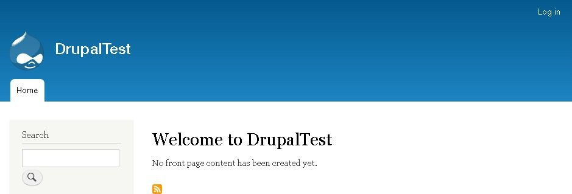
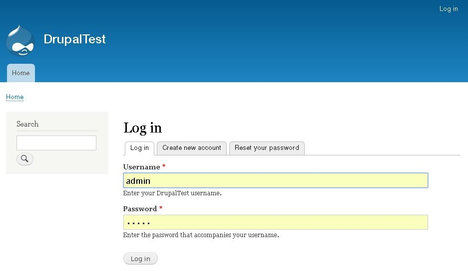
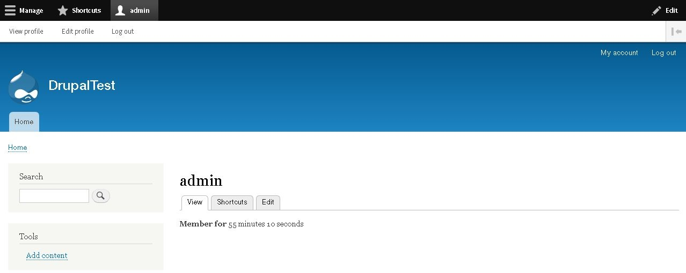
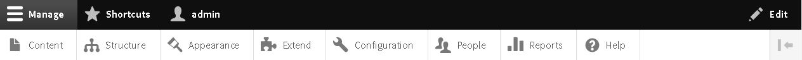
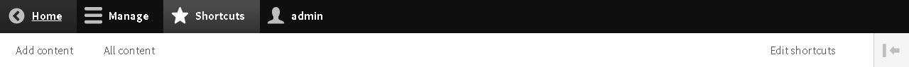
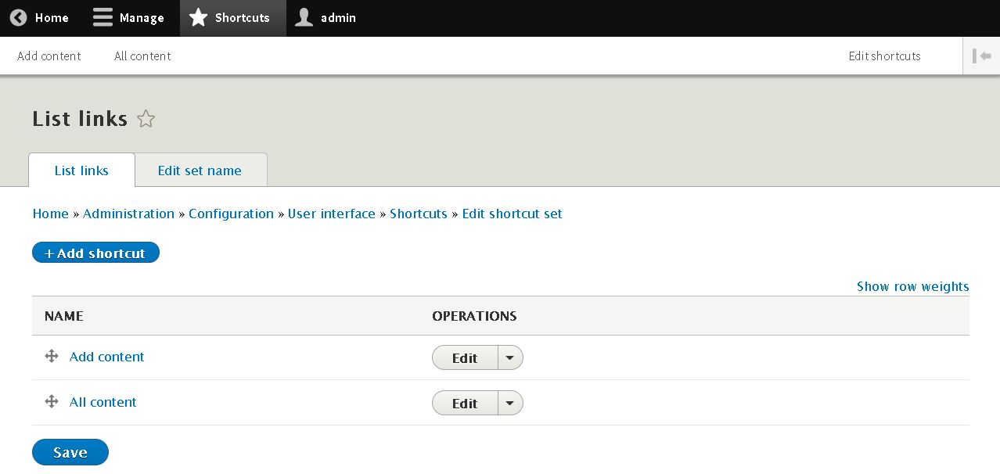
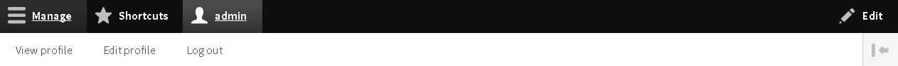
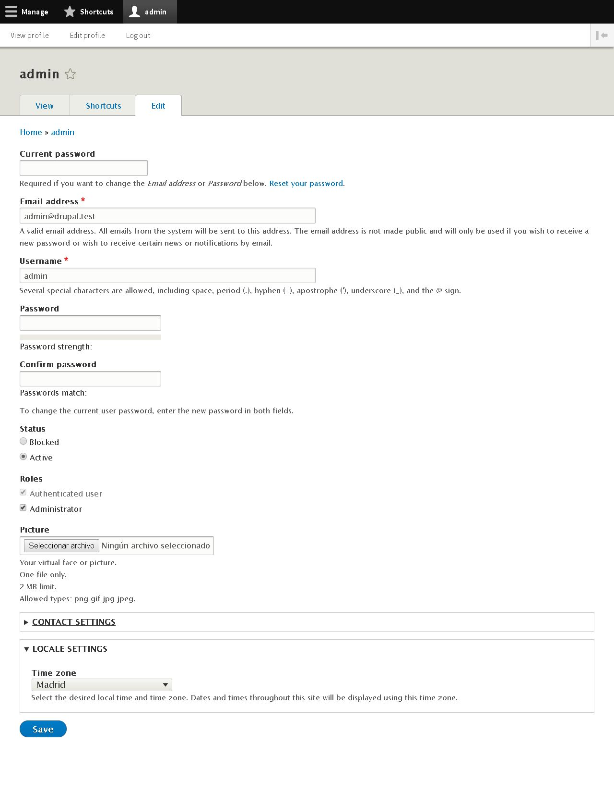

DRUPAL 8
========

2.DASHBOARD & TOOLBAR
=====================

Si accedemos a la web sin loguearnos encontraremos la siguiente imagen:

El primer paso a seguir consiste en loguearse dentro de la web, para ello podemos hacer click dentro del link **LogIn** o acceder a la url por defecto [/user/login](/user/login)

En este ubicación podremos:
* **Loguearnos** [/user/login](/user/login)
* **Registrarnos** [/user/register](/user/register)
* **Restaurar nuestro password** [/user/password](/user/password)

A partir de este punto podemos ver la **Toolbar**, la cual ayudará a administrar la web.

Esta barra podrá modificarse, añadiendo o quitando opciones, lo cuál veremos más adelante.

Si desglosamos la **Toolbar**, tenemos las opciones de **Manage** (Administración de la web), **Shortcuts** (Accesos rápidos) y **User** (Usuario).

Dentro de **Manage**, tendremos acceso a **Content** (Contenido), **Structure** (Estructura), **Appearance** (Apariencia), **Extend** (Extensiones), **Configuration** (Configuración), **People** (Usuarios), **Reports** (Informes/reportes), **Help** (Ayuda).

En **Shortcuts** o **acceso rápido**, podremos ubicar las opciones de administración que más utilicemos para así tenerlas mas a mano. Por defecto Drupal nos da dos opciones, **Add content** y **All Content**.
Si queremos añadir más haremos click en **Edit Shorcuts** o en la url [/admin/config/user-interface/shortcut/manage/default/customize](/admin/config/user-interface/shortcut/manage/default/customize)

En **user**, tendremos acceso a **View Profile** (Perfil de usuario), **Edit Profile** (Editar perfil) y **Log Out** (Salír).

# View Profile
* Accedemos en **Toolbar >> user >> View Profile** o la url [/user/{idUser}](/user/{idUser})
* Permite **ver la información** del perfil, ver los **shorcuts** del usuario y **Editar** el perfil.

# Edit Profile
* Accedemos en **Toolbar >> user >> Edit Profile** o la url[/user/{idUser}/edit](/user/{idUser}/edit)
* Permite **editar** los **datos del perfil**, tales como **Nombre de usuario**, **password**, **Estado**, **Rol**, **Imagen de perfil**, **Configuración de perfil** y **TimeZone** del usuario.

2.1.DASHBOARD
-------------

**Curiosidad** Todo el contenido del Backend de Drupal, tanto el **DashBoard** como la **Toolbar** son **100% responsive**. Esto ayuda a poder administrar la web desde cualquier tipo de dispositivo.
