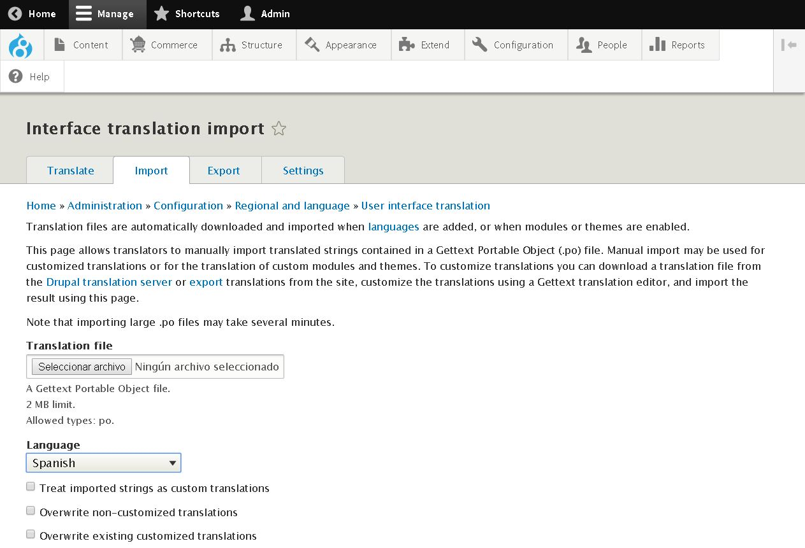
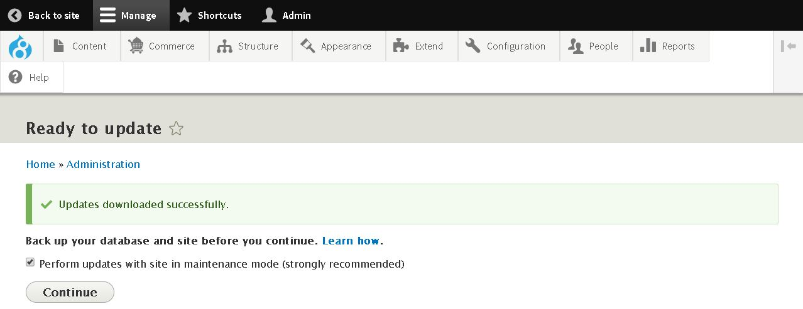

DRUPAL 8
========

2.CONFIGURACIÓN (FRIST STEPS)
=============================

2.1.Traducir la Interfaz de usuario
-----------------------------------

* Nos aseguramos que tenemos instalados los módulos del **Core Drupal** de **MULTILANGUAL**:
    * **Configuration Translation**, Provee un interfaz de traducción para la configuración.
    * **Content Translation**, Permite a los usuarios traducir entidades de contenidos.
    * **Interface Translation**, Traduce la interfaz de usuario.
Para ello accedemos a **Toolbar >> Manage >> [Extend](/admin/modules)** y chequeamos los módulos indicados. Posteriormente pulsamos en **Install**.

* Activamos nuestro idioma accediendo a **Toolbar >> Manage >> [Configuration](/admin/config) >> [Regional](/admin/config/regional) >> [Language](/admin/config/regional/language)** o a la url [/admin/config/regional/language](/admin/config/regional/language).

A continuación podremos seleccionar el idioma que se usará por **Defecto** para la web. De no existir en el listado inicial que facilita **Drupal8** podremos instalarlo accediendo click en **[+Add Language](/admin/config/regional/language/add)**

Posteriormente lo seleccionaremos como idioma por defecto y haremos click en **Save Configuration**.

Ya podremos acceder a **Toolbar >> Manage >> [Configuration](/admin/config) >> [Regional](/admin/config/regional) >> [User Interface Translation](/admin/config/regional/translate)** o a la url [/admin/config/regional/translate](/admin/config/regional/translate) para traducir la interface de usuario.

Donde podremos importar el idioma deseado, el archivo de traducción que puede descargarse en [https://localize.drupal.org/](https://localize.drupal.org/) y la configuración de instalación. Finalmente podremos hacer click en **Import**.

<table style="width:100%;">
  <tr>
    <td>
      **Enhorabuena!!! Ya tienes tu interfaz traducida....**
    </td>
  </tr>
</table>

--------------------------------------------------------------------

2.2.Actualizar Módulos
----------------------

El siguiente punto importante consiste en actualizar el **Core** y los módulos que ya tenemos instalados.

Por orden habrá que realizar primero la actualización de todos los **módulos** y posteriormente del **Core**.

2.2.1.Actualizar **Módulos Instalados**
---------------------------------------

Para ello accedemos a **Toolbar >> Manage >> [Extend](/admin/modules) >> [Update](/admin/modules/update)** o en la url [/admin/modules/update](/admin/modules/update) y seleccionamos los módulos que queremos actualizar.

Y hacemos click en **Download these updates**.

Es probable que encontremos el siguiente **FALLO** si trabajamos en local.

<table><tr><td>
**Nota1** Este error es debido a que el **curl** no tiene autorizaciones de certificación válidas para la **Validación de SSL**. Así descargaremos el certificado  [cacert.pem](https://gist.github.com/VersatilityWerks/5719158/download). Y lo colocaremos dentro de **C:\ Windows\** y agregamos a la configuración de **php.ini** la línea `curl.cainfo = "C:\Windows\cacert.pem"`.
  
**MUY IMPORTANTE** reiniciar el servidor web local, **WAMP** en este caso y volver a intentar una actualización manual en Drupal.
 

[Fuente de la Solución: Installing Modules](https://www.drupal.org/forum/support/post-installation/2016-01-10/installing-modules)

</td></tr></table>

Pulsamos en **Continue**, obtendremos información relativa a las actualizaciones de los módulos llevada a cabo.

A continuación pulsaremos en **Run database updates**.

2.2.2.Actualizar **Core Drupal**
--------------------------------

Accedemos a la consola y una vez dentro del proyecto lanzamos el comando `composer update`.

Previamente se nos recomienda:
* **Realizar Copias de Seguridad**, podemos realizarlo manualmente o mediante el módulo **[BACKUP & MIGRATE](https://www.drupal.org/project/backup_migrate)**.
* Colocar el site en **Modo de Mantenimiento**, accediendo a **Toolbar >> Manage >> [Configuration](/admin/config) >> [Development](/admin/config/development) >> [Maintenance](/admin/config/development/maintenance)** o accediendo a la url [/admin/config/development/maintenance](/admin/config/development/maintenance)
