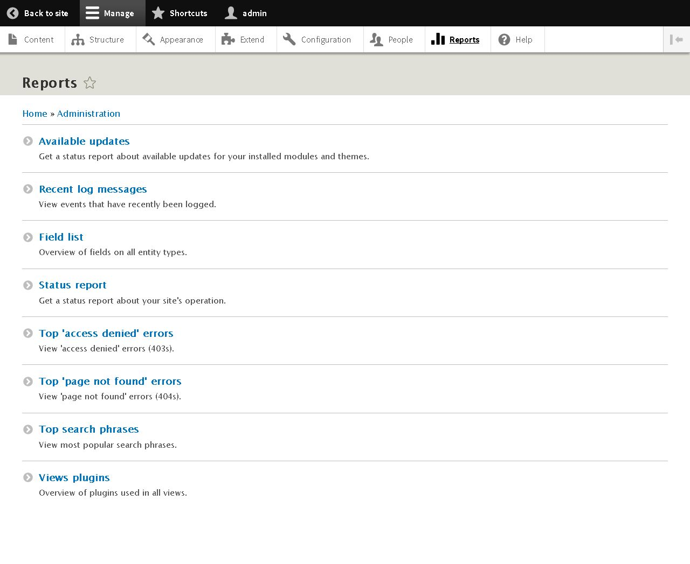
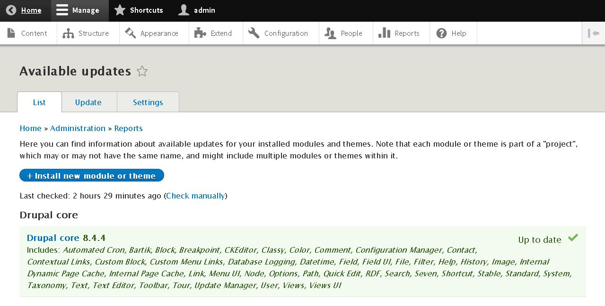
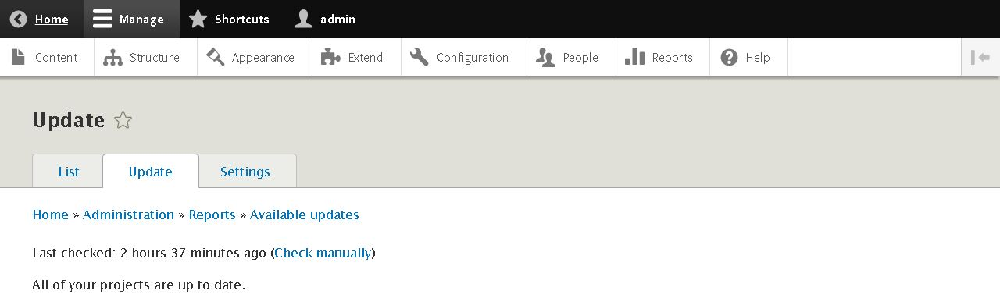
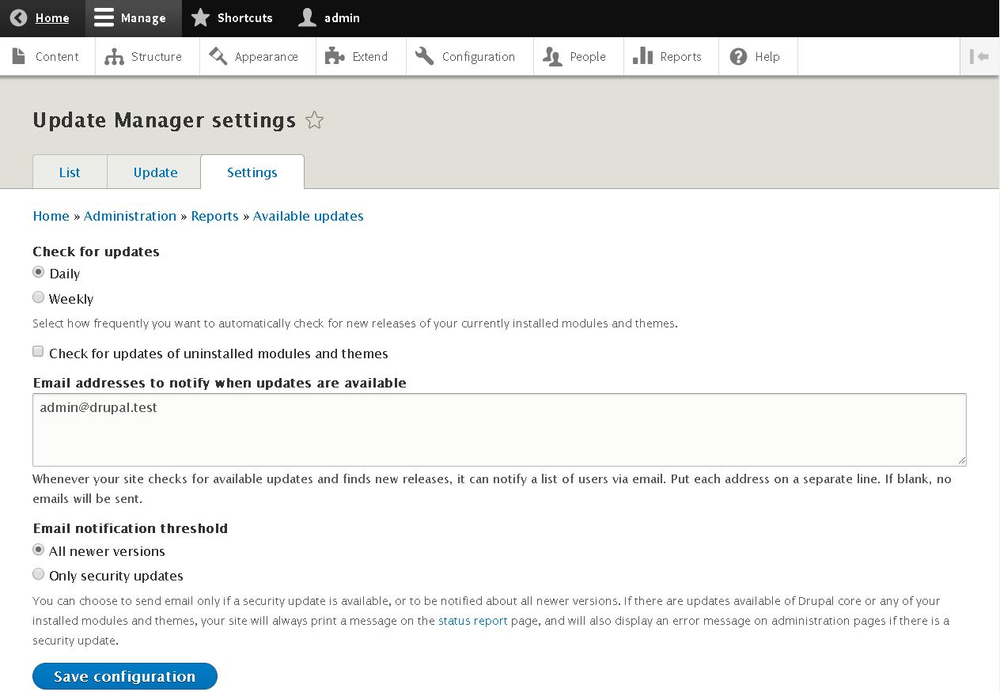
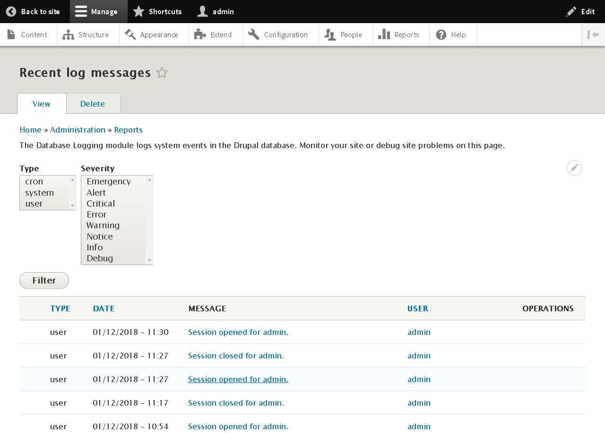
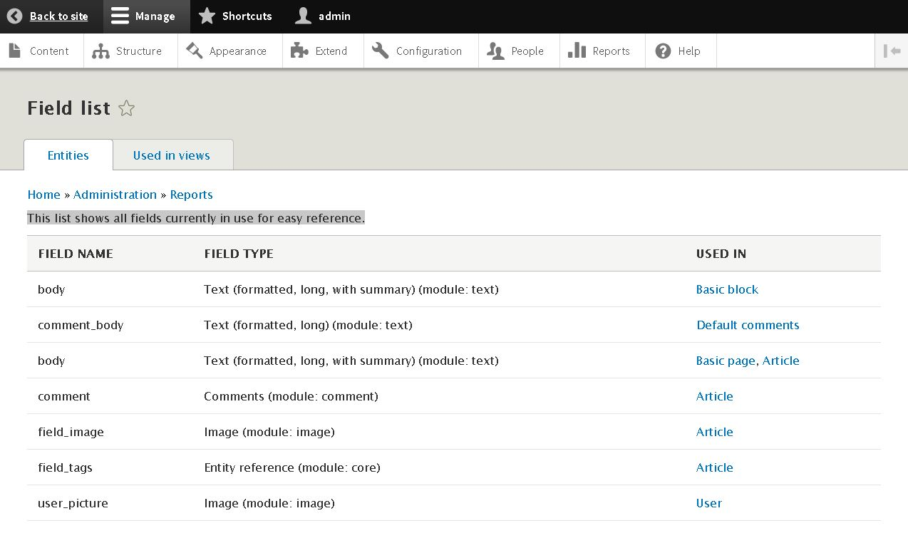
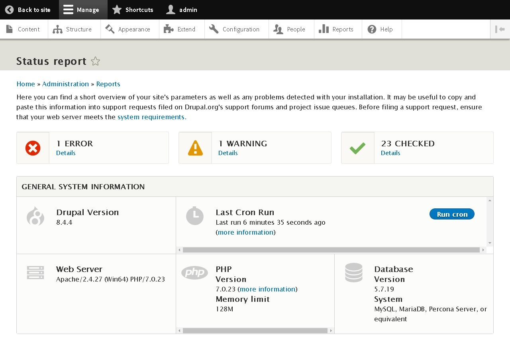
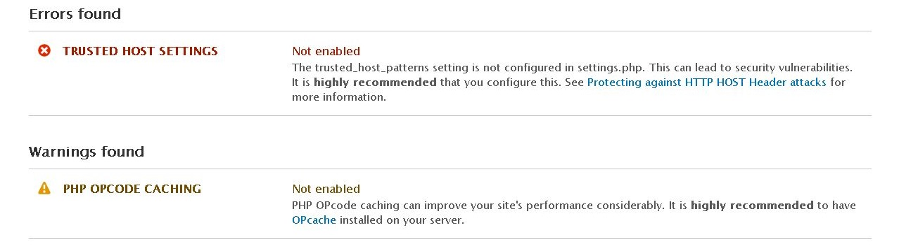
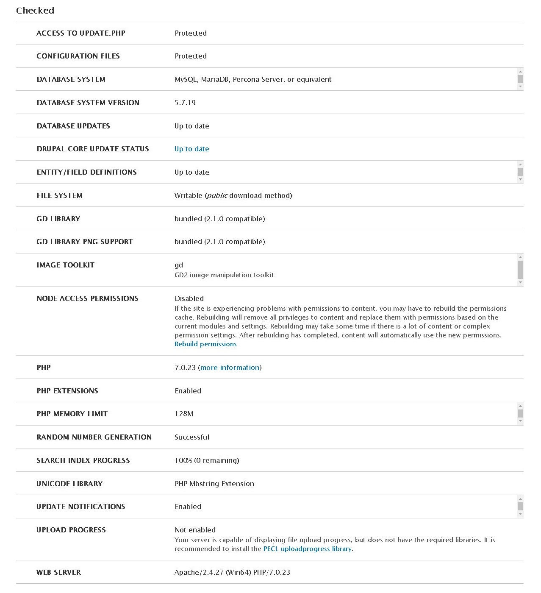

DRUPAL 8
========

3.REPORTS
=========

Para acceder la opción de **Reportes** entraremos en **Toolbar >> Manage >> Reports** o en la url [/admin/reports](/admin/reports)

Aquí podremos acceder a **Available Updates** (Actualizaciones Disponibles), **Recent Log Messages**, **Field List**, **Status Report**, **Top 'Access denied' errors**, **Top Page Not Found' errors**, **Top Search Phrases**, **Views Plugins**

3.1.AVAILABLE UPDATES
---------------------

Accedemos en **Toolbar >> Manage >> Reports >> Available Updates** o la url [/admin/reports/updates](/admin/reports/updates).
Aquí puedes encontrar información sobre las **actualizaciones disponibles** para sus **módulos** y **temas** instalados. Hay que tener en cuenta que cada módulo o tema es parte de un **"proyecto"**, que puede tener o no el mismo nombre, y puede incluir múltiples módulos o temas dentro de él.

Dentro de esta ventana tenemos las opciones de **List** (listado de actualizaciones), **Update** (Último Chequeo) y **Settings** (Configuración).

A **Updates**, accedemos mediante **Toolbar >> Manage >> Reports >> Available Updates >> Updates** o la url [/admin/reports/updates/update](/admin/reports/updates/update).

Aquí podemos ver la **revisión de actualizaciones**, y seleccionar la opción de realizar una **nueva búsqueda de actualizaciones** ( *Check Manually*).

A **Settings**, accedemos mediante **Toolbar >> Manage >> Reports >> Available Updates >> Settings** o la url [/admin/reports/updates/settings](/admin/reports/updates/settings).

Aquí podemos cambiar la **configuración** relativa a las **actualizaciones del Site**, incluidas las notificaciones de las mismas.

Podemos ver que sólo tenemos instalado el **Núcleo de Durpal** actualizado (**Up to date**)

3.2.RECENT LOG MESSAGES
-----------------------

El **módulo de registro de la base de datos** alamacenará los eventos del sistema en la base de datos Drupal. Es recomendable supervisar esta página para solucionar problemas del site. Para acceder a **Recent Log Messages** entramos en **Toolbar >> Manage >> Reports >> Recent Log Messages** o usando la url [/admin/reports/dblog](/admin/reports/dblog).

**IMPORTANTE** Dentro de cada notificación tenemos acceso a información de la misma.

| **NOTA** **Error 404** (Página no encontrada) y **Error 403** (Acceso Denegado) es también administrado por **Drupal 8**. |
|:----------------------------------------------------------------|

3.3.FIELD LIST
--------------

Dentro de **Field List** tenemos acceso a una lista que muestra todos los campos actualmente en uso para una fácil referencia. Para acceder entramos en **Toolbar >> Manage >> Reports >> Field List** o usando la url [/admin/reports/fields](/admin/reports/fields).

3.4.STATUS REPORT
-----------------

En **Status Report** tenemos una breve descripción de los parámetros de su sitio, así como cualquier problema detectado durante la instalación. Para acceder entramos en **Toolbar >> Manage >> Reports >> Status Report** o usando la url [/admin/reports/fields/status](/admin/reports/fields/status).

**NOTA** Puede ser útil copiar y pegar esta información en las solicitudes de soporte archivadas en los foros de soporte de [Drupal.org](Drupal.org) y en las colas de problemas del proyecto. Antes de presentar una solicitud de soporte, habría que asegurarse de que el servidor web cumpla con los requisitos del sistema.

El error **TRUSTED HOST SETTINGS** advierte de que tu sitio puede ser clonado, y como puedes evitarlo.

**CURIOSIDAD** Para eliminar el error de **TRUSTED HOST SETTINGS**
 que aparece después de la instalación hay que modificar en el archivo **/site/default/setting.php**. **NO OLVIDES** devolver los permisos a este archivo tras modificarlo.

3.5.TOP 'ACCESS DENIED' ERRORS
------------------------------

En **Top 'Access Denied' Errors** podemos ver el listado de errores que han ocurrido en la web relativos al **Acceso Denegado** (**Error 403**). Para acceder entramos en **Toolbar >> Manage >> Reports >> Top 'Access Denied' Errors** o usando la url [/admin/reports/fields/access-denied](/admin/reports/fields/access-denied).

3.6.TOP 'PAGE NOT FOUND' ERRORS
------------------------------

En **Top 'Page Not Found' Errors** podemos ver el listado de errores que han ocurrido en la web relativos al **Página no encontrada** (**Error 404**). Para acceder entramos en **Toolbar >> Manage >> Reports >> Top 'Page Not Found' Errors** o usando la url [/admin/reports/fields/page-not-found](/admin/reports/fields/page-not-found).

3.7.TOP SEARCH PHRASES
------------------------------

En **Top Search Phrases** podemos ver el listado de las **Frases** más **buscadas en el site**. Para acceder entramos en **Toolbar >> Manage >> Reports >> Top Search Phrases** o usando la url [/admin/reports/fields/search](/admin/reports/fields/search).

3.8.VIEWS PLUGINS
------------------------------

En **Views Plugins** podemos ver el listado de **Plugins** utilizados en las **Views**. Para acceder entramos en **Toolbar >> Manage >> Reports >> Views Plugins** o usando la url [/admin/reports/fields/views-plugins](/admin/reports/fields/views-plugins).
