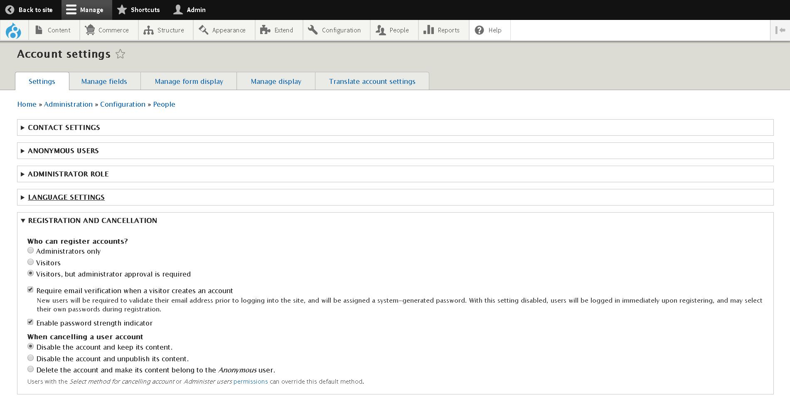

DRUPAL 8
========

2.CONFIGURACIÓN AVANZADA
========================

Bloquear la Creación de nuevas cuentas (Acceso a Registro)
----------------------------------------------------------
Accedemos a **Toolbar >> Manage >> [Configuration](/admin/config) => [PEOPLE](/admin/config/people) => [Account Setting](/admin/config/people/accounts)** o a la url [/admin/config/people/accounts](/admin/config/people/accounts).

En el apartado **REGISTRATION AND CANCELLATION** podemos seleccionar el método para generar nuevas cuentas de usuario.

Traducir Interface Backend
--------------------------
Accedemos a **Toolbar >> Manage >> [Configuration](/admin/config) => [REGIONAL](/admin/config/regional) =>  [Translate](/admin/config/people/accounts) => [IMPORT](/admin/config/regional/translate/import)** o a la url [/admin/config/regional/translate/import](/admin/config/regional/translate/import).

Actualizar Núcleo (Manual) (COMPROBAR)
---------------------------------------
* Descargamos y extraemos la última versión de Drupal desde [aquí](https://www.drupal.org/home).
* Inicie sesión en el panel de administración de su sitio usando sus credenciales de administrador.
* Hacemos una copia de seguridad de la base de datos (por ejemplo, a través de PHPMyAdmin) y del sitio web antes de continuar.
* Ponemos el sitio en **modo de mantenimiento** entrando en **Toolbar >> Manage >> [Configuration](/admin/config) => [Development](/admin/config/development) => [Maintenance](/admin/config/development/maintenance)**.
* Eliminamos el directorio **'core'** y **'vendor'** de su proyecto.
* Eliminamos también todos los archivos del directorio de nivel superior de su proyecto, dejando de lado los archivos en los que realizó cambios.
* Subimos el directorio central de la versión de Drupal que descargó en el paso 1 a su proyecto.
* Subimos los archivos **.htaccess**, **composer.lock** y **composer.json** de la versión de Drupal descargada a su proyecto.
* Cargamos el directorio del proveedor desde la versión de descarga de Drupal a su proyecto.
* Accedemos a **/site/default/setting.php** y modificamos la línea `$settings['update_free_Access'] = FALSE;` cambiandola por `$settings['update_free_Access'] = TRUE;`. **IMPORTANTE** Volver a cambiar después)
* Vamos a **[yoursite.com/update](yoursite.com/update)** donde **"yoursite"** es el nombre de dominio de su sitio web.
