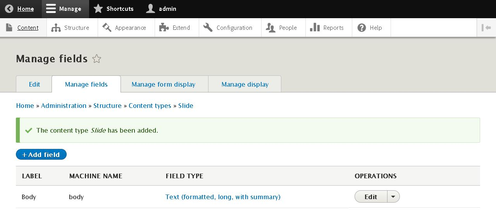
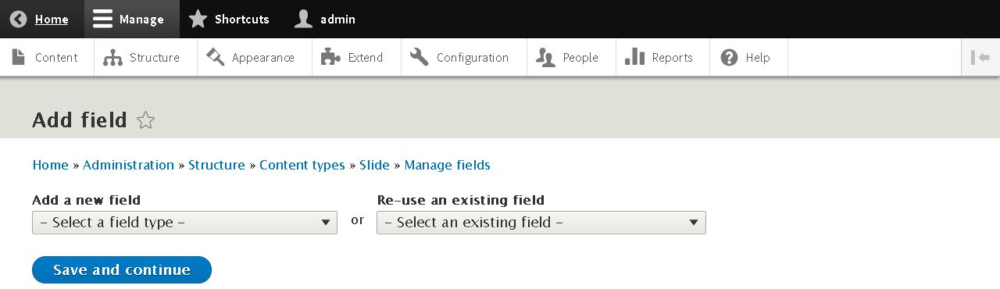

DRUPAL 8
========

4.CONTENT
=========

Para crear nuevo contenido en Drupal8, hay que acceder a **Toolbar >> Manage >> Content >> +Add Content** o a la url [/node/add](/node/add).

Por defecto drupal permite crear dos tipos de contenido en la web:
* **Artículo**
* **Página básica**

4.1.CREAR UN NUEVO TIPO DE CONTENIDO
------------------------------------

Para crear un nuevo tipo de contenido accedemos a **Toolbar >> Manage >> Structure >> Content Types >> +Add content Type** o a la url [/admin/structure/types/add](/admin/structure/types/add)

En este apartado indicaremos algunos datos de interes relativos **Tipo de Contenido**, como son el **Título** y la **Descripción**.

Además podemos configurar la **Configuración del formulario de envío** designando el **Título de la etiqueta del campo**, **Previsualización antes de enviarlo** y la **Explicación o pauras de presentación**.

Las **Opciones de Publicación** por defecto, automáticamente podremos seleccionar si se **Publicará**, o si se mostrará en la **Página de inicio**, o si aparecerá en **forma de Lista**, o si queremos que existan **revisiones del tipo de contenido** (Recomendable sólo para contenidos largos).

Permite **Mostrar el autor** de un contenido, así como sus diferentes revisiones (Recomendable sólo para contenidos largos).

Ubicar enlaces

4.1.1.AÑADIR CAMPOS AL NUEVO CONTENIDO
--------------------------------------

**CURIOSIDAD** Drupal nos provee de un campo **Body** por defecto al crear un nuevo tipo de contenido.

Mediante el Botón **+Add Field** (**Toolbar >> Manage >> Structure >> Content Types >> Manage Fields >> +Add Field** o la url [/admin/structure/types/manage/{contentType}/fields/add-field](/admin/structure/types/manage/{contentType}/fields/add-field)) podremos incluir nuevos campos al tipo de contenido.

