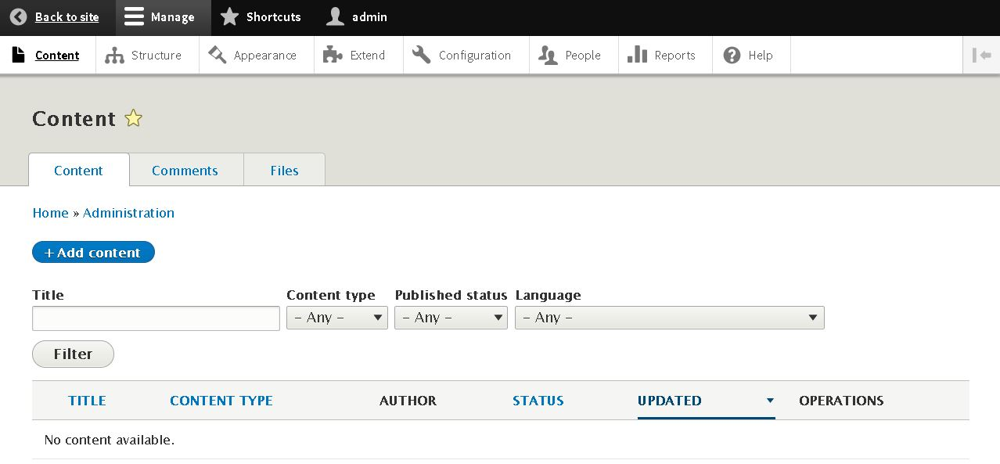
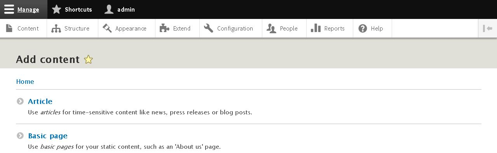
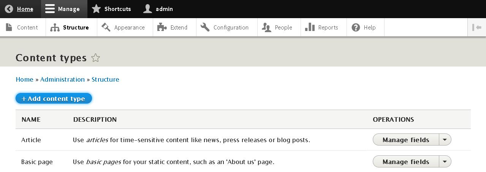
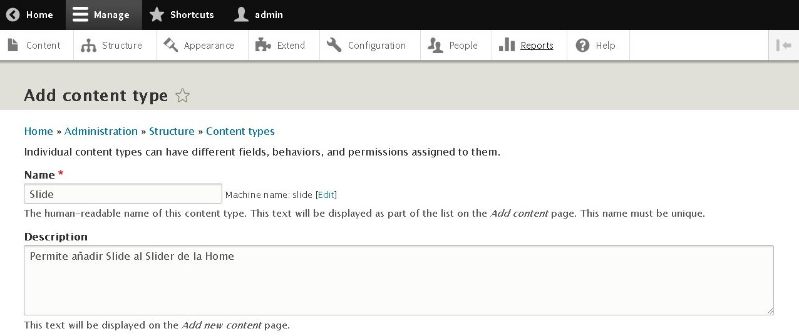
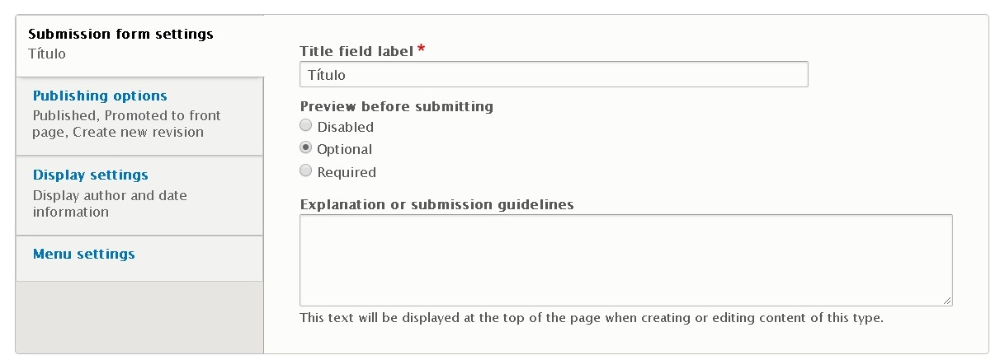
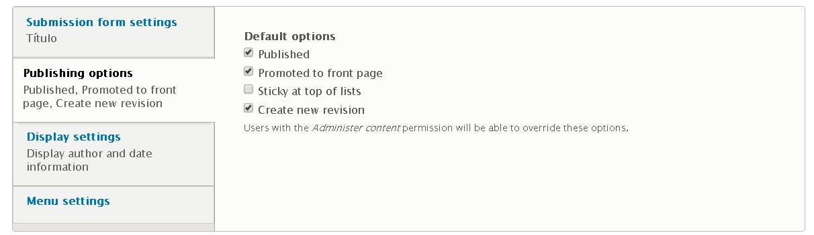
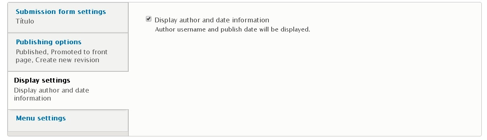
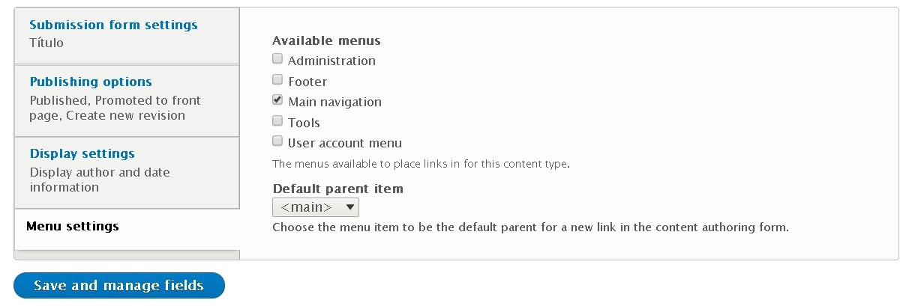

DRUPAL 8
========

4.CONTENT
=========

Para crear nuevo contenido en Drupal8, hay que acceder a **Toolbar >> Manage >> Content >> +Add Content** o a la url [/node/add](/node/add).

Por defecto drupal permite crear dos tipos de contenido en la web:
* **Artículo**
* **Página básica**

4.1.CREAR UN NUEVO TIPO DE contenido
------------------------------------

Para crear un nuevo tipo de contenido accedemos a **Toolbar >> Manage >> Structure >> Content Types >> +Add content Type** o a la url [/admin/structure/types/add](/admin/structure/types/add)

En este apartado indicaremos algunos datos de interes relativos **Tipo de Contenido**, como son el **Título** y la **Descripción**.

Además podemos configurar la **Configuración del formulario de envío** designando el **Título de la etiqueta del campo**, **Previsualización antes de enviarlo** y la **Explicación o pauras de presentación**.

