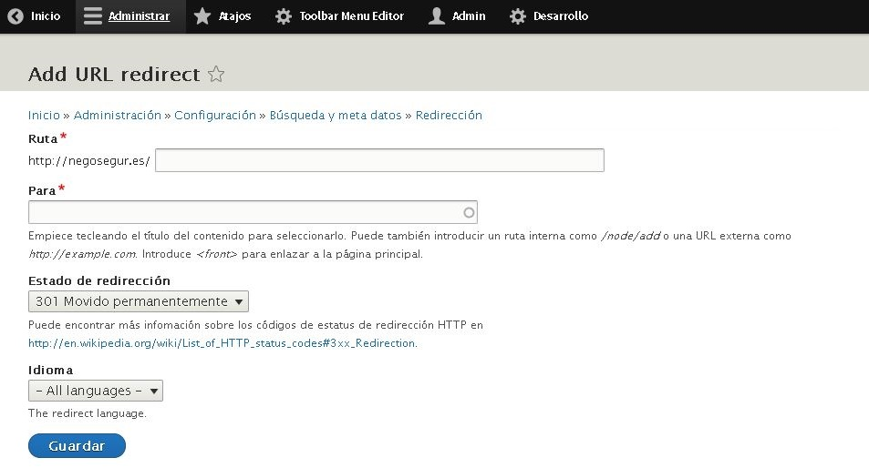
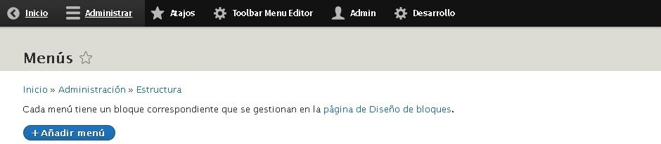
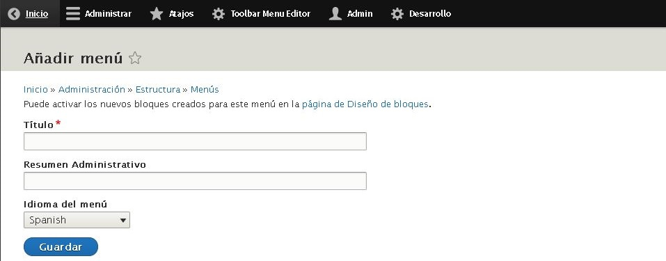
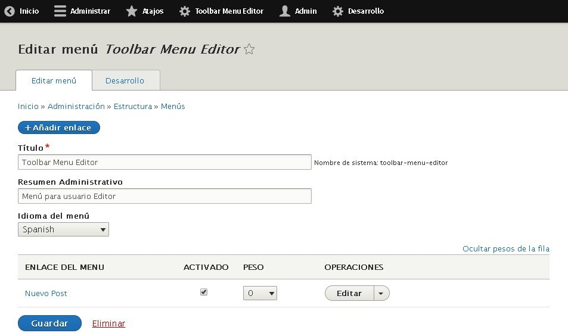
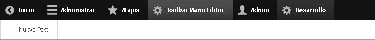
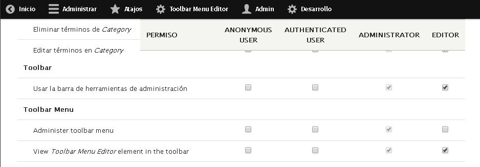

MÓDULOS DRUPAL 8
================

INSTALAR NUEVO MÓDULO
---------------------
Ejemplo [BACKUP & MIGRATE](https://www.drupal.org/project/backup_migrate)

* Acceder a la url del módulo, en este caso [Backup and Migrate](https://www.drupal.org/project/backup_migrate), y seleccionar la última versión disponible (copiar la url, parecida a [https://ftp.drupal.org/files/projects/backup_migrate-8.x-4.0-beta3.tar.gz](https://ftp.drupal.org/files/projects/backup_migrate-8.x-4.0-beta3.tar.gz))

<table>
  <tr>
    <td>**WEB en Producción**</td>
  </tr>
  <tr>
    <td>
      * Acceder dentro de la web  a instalar en **BM >> Extend >> + Install new module** ([http://dominio.com/admin/modules/install](http://dominio.com/admin/modules/install)), y copiar la url anterior.
        
      
        
      
    </td>
  </tr>
  <tr>
    <td>**WEB en Local**</td>
  </tr>
  <tr>
    <td>
      * Descargar el módulo y usar la opción de subir módulo, después pulsar instalar.
    </td>
    </tr>
</table>

* Acceder dentro de la web  a instalar en **BM >> Extend >> + Install new module**

* Acceder a **BM >> Manage >> Extend** ([http://dominio.com/admin/modules](http://dominio.com/admin/modules)) y seleccionar el módulo para instalarlo.

MÓDULOS IMPORTANTES
-------------------
* [Google Analytics](https://www.drupal.org/project/google_analytics)
* [Backup and Migrate](https://www.drupal.org/project/backup_migrate)
* [Redirect](https://www.drupal.org/project/redirect)
* [Simple XML sitemap](https://www.drupal.org/project/simple_sitemap)
* [Toolbar Menu](https://www.drupal.org/project/toolbar_menu)

BACKUP & MIGRATE
----------------

[Backup and Migrate](https://www.drupal.org/project/backup_migrate) permite realizar backup incluyendo la base de datos.

<table style="with:100%;">
<tr>
  <td>
**IMPORTANTE** Se recomienda su uso **sólo** para hacer una backup de la **BD**.
  </td>
  </tr>
</table>

REDIRECT
-------------------

[Redirect](https://www.drupal.org/project/redirect) permite realizar el redireccionamiento 301 de las url.

* Para acceder al módulo entrar en **BM >> Manage >> Configuration >> Search and Metadata >> [URL redirects](/admin/config/search/redirect)**

* Dentro de **Add redirect** ([http://dominio.com/admin/config/search/redirect/add](http://dominio.com/admin/config/search/redirect/add))

* Dentro de **Settings** ([http://dominio.com/admin/config/search/redirect/settings](http://dominio.com/admin/config/search/redirect/settings))

TOOLBAR MENU
------------

[Toolbar Menu](https://www.drupal.org/project/toolbar_menu) permite construir menús alternativos para usuarios editor.

* Creamos un menú estándar con el contenido que queremos que aparezca accediendo a **BM >> Manage >> Estructure >> Menu**, y hacemos click en **+Add Menu**.

* Creamos el meú con su descripción, y dentro del mismo los enlaces que queremos.

<table style="with:100%;">
<tr>
  <td>
**IMPORTANTE** Los enlaces deben de tener los permisos adecuados para poder acceder al menú.
  </td>
  </tr>
</table>

* Dentro de **BM >> Manage >> Configuration >> User Interface >> [ToolbarMenu](/admin/config/user-interface/toolbar_menu/elements)** podemos añadir el enlace al menú creado anteriormente.

Este menú aparecerá en la **Toolbar**.

* El siguiente paso consiste en modificar los permisos para solo tener acceso al menú generado.

EXTRAS
======

COMO IMPORTAR WEB
-----------------

Comprimimos los archivos de la web y las subimos a su nuevo dominio, con la base de datos se recomienda usar el módulo [backup_migrate](https://www.drupal.org/project/backup_migrate) y para subirla usaremos [bigdump](http://www.ozerov.de/bigdump/).
